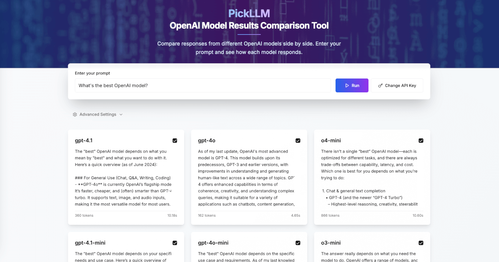

# PickLLM

**OpenAI Model Results Comparison Tool**

Compare responses from different OpenAI models side by side. Enter a prompt and see how GPT-4, GPT-3.5, and other OpenAI models respond in parallel.



## Features

- 🔄 **Side-by-side comparison** of multiple OpenAI models
- ⚡ **Parallel execution** for faster results
- 🎛️ **Advanced settings** (temperature, top_p, max_completion_tokens)
- 📱 **Responsive design** with modern UI
- 🔧 **Customizable model list** - add or remove any OpenAI models

## Installation & Setup

1. **Clone the repository**
   ```bash
   git clone https://github.com/your-username/pickllm.git
   cd pickllm
   ```

2. **Install dependencies**
   ```bash
   npm install
   ```

3. **Run the development server**
   ```bash
   npm run dev
   ```

4. **Open your browser**
   Navigate to [http://localhost:3000](http://localhost:3000)

5. **Add your OpenAI API Key**
   - Click "Set API Key" button
   - Enter your OpenAI API key (get one from [OpenAI Platform](https://platform.openai.com/api-keys))
   - Your key is stored locally in your browser only

## Production Build

```bash
npm run build
npm start
```

## Important Notes

### 🔐 API Key Security
Your OpenAI API key is **never stored on the server**. The key is:
- Stored only in your browser's localStorage
- Sent directly to OpenAI's API through our proxy route
- Never logged or saved on our backend

You can verify this by checking the [API route code](app/api/openai/route.ts) - the key is only used to make requests to OpenAI and is not persisted anywhere.

### 🤖 Built with AI
This project was built using [bolt.new](https://bolt.new) AI-powered development platform.

## Tech Stack

- **Framework**: Next.js 13
- **Styling**: Tailwind CSS + shadcn/ui components
- **Language**: TypeScript
- **Deployment**: Vercel-ready

## Contributing

Contributions are welcome! Please feel free to submit a Pull Request.

## License

MIT License - see LICENSE file for details.

---

Made by [Denis L](https://x.com/d3liaz) • Live at [pickllm.com](https://pickllm.com)
